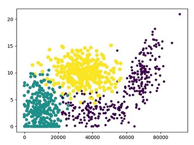
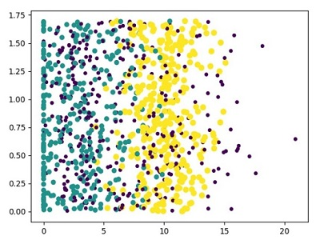
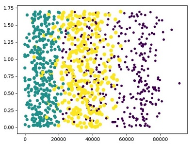
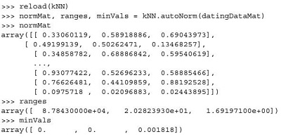
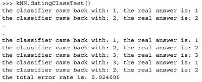
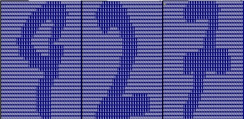
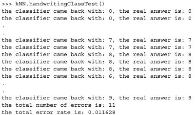

# MachineLearning_kNN
### 约会网站数据分析（黄点：机具魅力 | 绿点：魅力一般 | 紫点：不喜欢）
#### x|每年获取的飞行常客里程数 && y|玩视频游戏所消耗的时间百分比

 
#### x|玩视频游戏所消耗的时间百分比 && y|每周消耗的冰淇淋公升数

 
#### x|玩视频游戏所消耗的时间百分比 && y|每周消耗的冰淇淋公升数

 
#### 归一化处理约会网站原始数据 && 测试该分类器效果

### 手写识别系统
#### 识别系统原图 && 识别数据效果（训练/数据集=0.9  |  测试/数据集=0.1）

