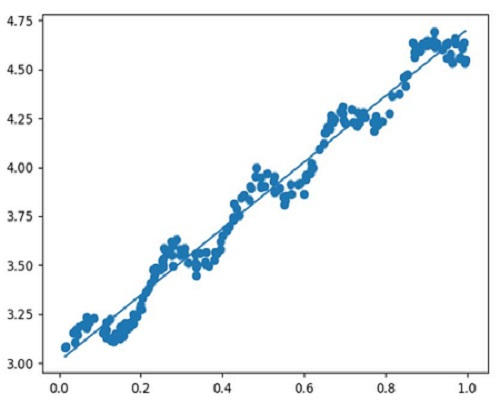
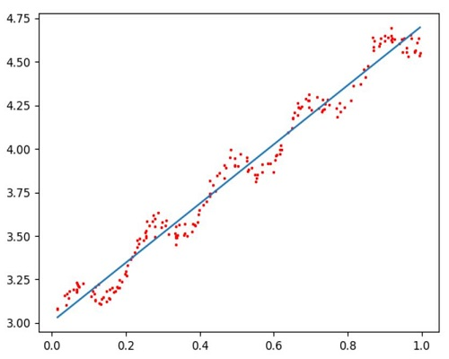
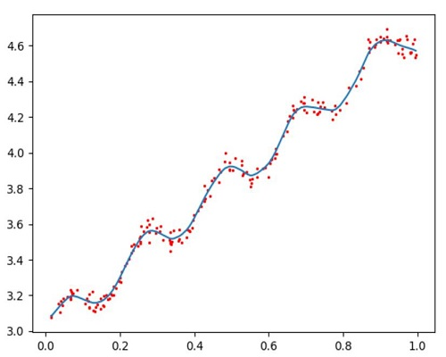
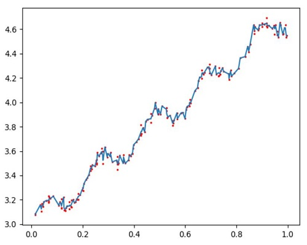
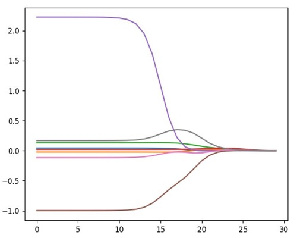
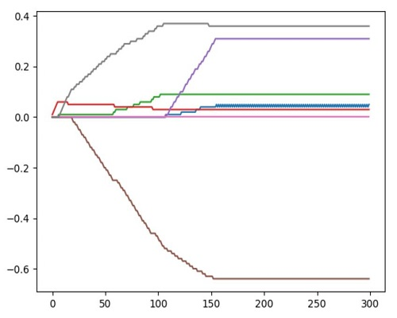

# MachineLearning_Regression
### 普通线性回归

 
### 局部加权线性回归
#### 情况1：确定回归函数时，用全局数据影响当前局部，产生普通回归

 
#### 情况2：确定回归函数时，用局部周围数据影响该局部，产生适当回归

 
#### 情况3：确定回归函数时，用局部周围更小范围的数据影响该局部，产生过拟合回归

 
### 岭回归
#### 回归系数变化图，靠近左侧为普通回归，靠近右侧为过拟合，适当回归时系数取两者中间适当位置

 
### 向前逐步回归
#### 鲍鱼数据系数与迭代次数之间关系，与上述通用回归方法相比，计算简便

